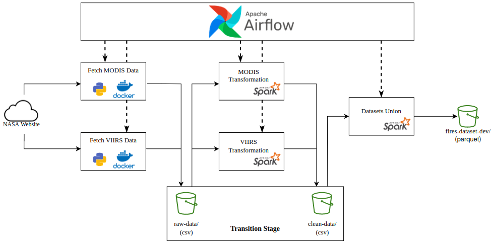
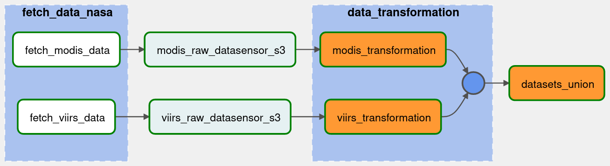

# Data pipeline NASA datasets

A data pipeline to help build a dataset to identify regions around the world that have a 
higher risk of wildfires and this way help to prevented.

**Data source:** [Active Fire Data](https://firms.modaps.eosdis.nasa.gov/active_fire/#firms-txt)

---
## *Workflow*
The workflow consists of: 
- Download files from two system (Nasa website) - *MODIS* and *VIIRS* - save it into 
  S3 bucket *raw-data* (transition stage)
- transform (modify schema) each one of the dataset seperatly each of other, save it 
  into S3 bucket *clean-data* (transition stage)
- union (merge) the datasets by columns name
- save the result dataset in parquet format into s3 bucket



---
## *DAG*



---
## Running the project

> **Note:** This project was developed in a linux environment with:
> - Ubuntu 22.04 LTS
> - Docker Engine Community version 23.0.1
> - Docker Compose version v2.16.0
> - Terraform version v1.4.2
>
> In addition, to have AWS credentials with sufficient permissions to perform 
> differently types of operations, as well as having AWS CLI configured. 

Inside the terraform directory, execute the following command. 
```bash
/terraform$ terrafom init
/terraform$ terrafom apply
```

return to the project root directoy, execute the following command.
```bash
$ docker compose build
$ docker compose up -d
``` 

Wait a few of minutes until all the services are finally running.

- `localhost:8083` -> Airflow GUI - `username: admin` - `password: admin`

